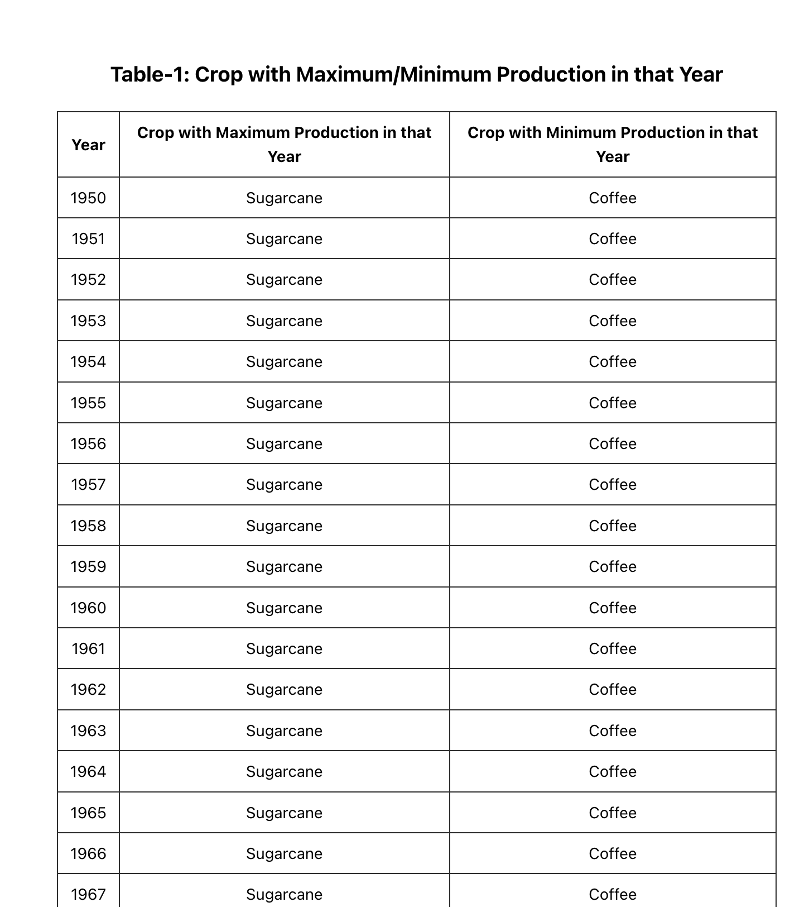
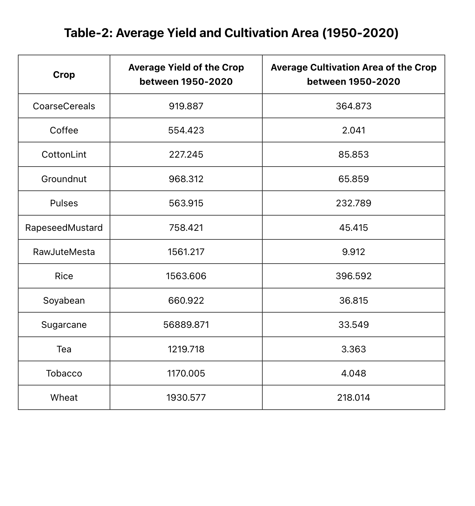

## Assignment Guidelines

### GitHub Link   [Link](https://github.com/adityas-ops/assign.git)


### screenshots

#### Table 1


#### Table 2



### How to Run This Project Locally?
1. **Clone the Repository**  
   ```bash
   git clone https://github.com/adityas-ops/assign.git
   ```

2. **Navigate to the Assignment Directory**  
   ```bash
   cd assign
   ```

3. **Install Dependencies**  
   ```bash
   yarn
   ```

4. **Start the Project**  
   ```bash
   yarn dev
   ```
